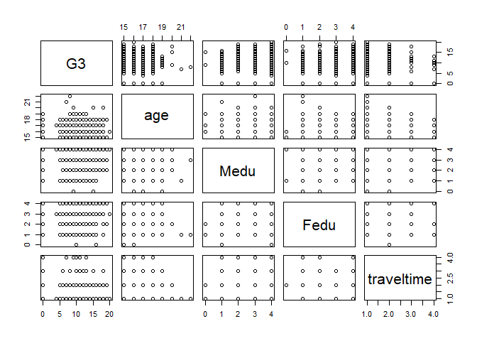
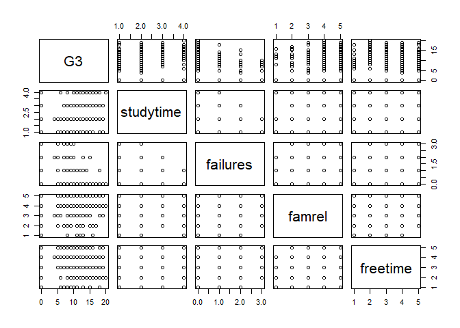
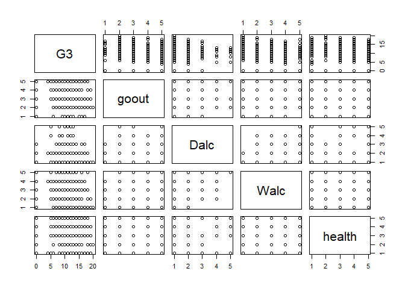
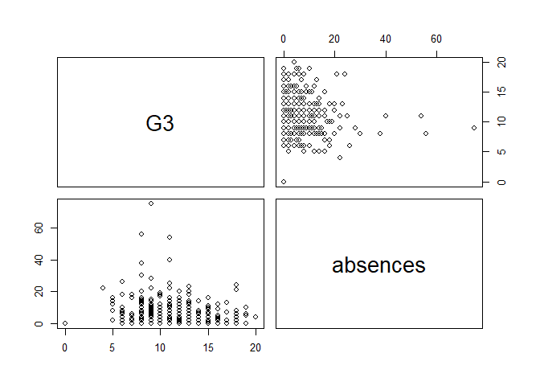
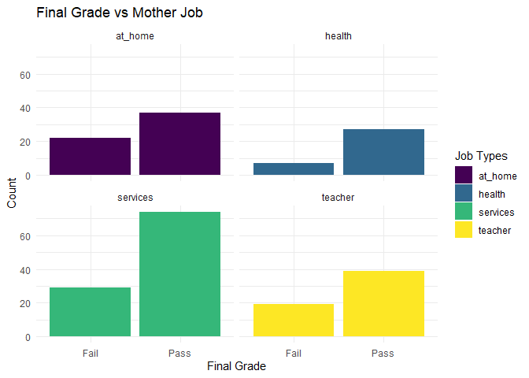
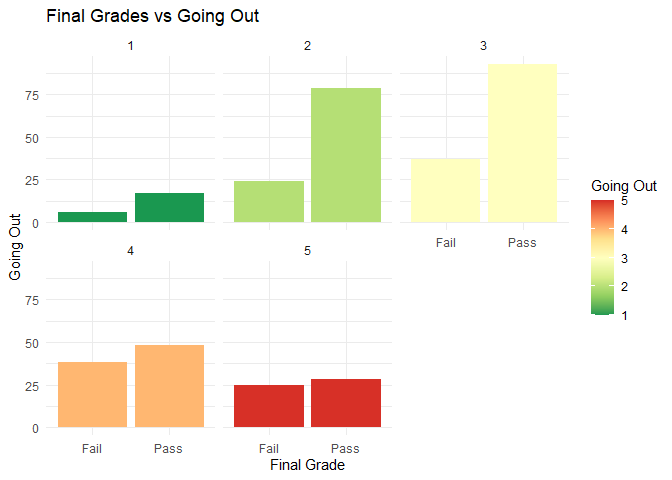
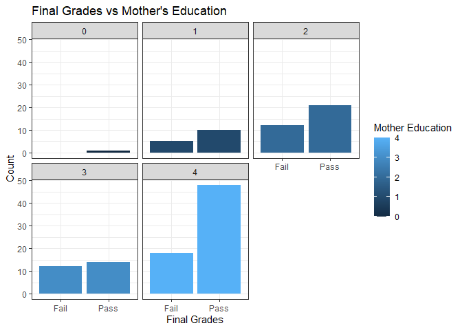
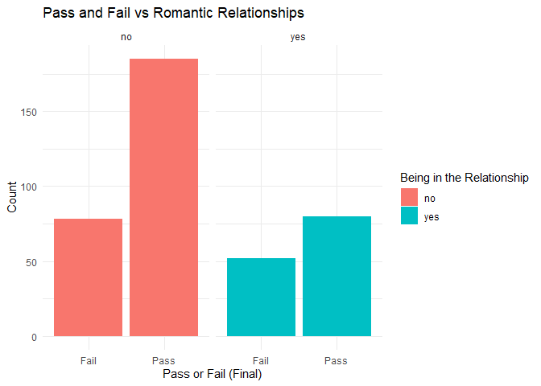
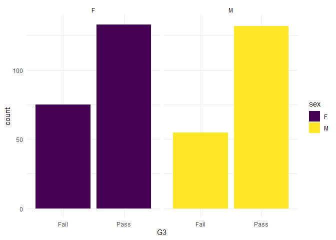
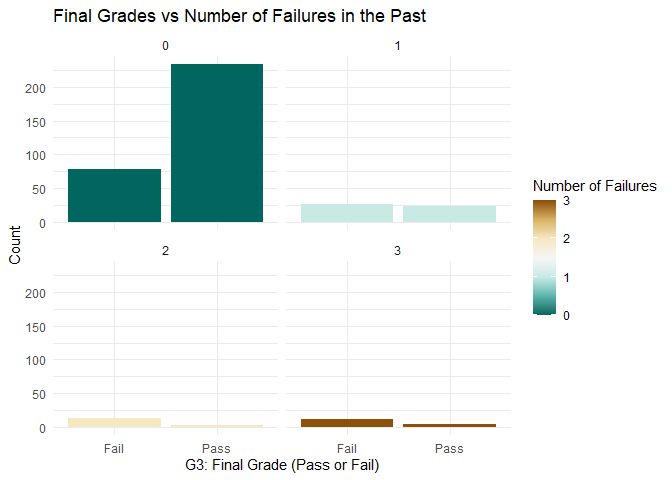

04 - Chapter Four - Preliminary Analysis
================
Nima Niarad
August 2020

<style> body {text-align: justify} </style>

<!-- Justify text. -->

## Getting to Know the Relationships through the Linear Regression

**4.1 - Loading Data**

``` r
library(readr)
MatStudent=read.table("C:/Nima/Rstudio/Git/Student Performance, Secondary Schools/Student-Performance--Secondary-Schools/student-mat.csv",sep=";",header=TRUE)
```

**4.2 - Relationship among Numeric Variables**

As G3 is the final grade, lets see if there is a pattern between G3 and
the others in the Math class:

``` r
pairs(~G3 + age + Medu + Fedu + traveltime, MatStudent)
```



``` r
pairs(~G3 + studytime + failures + famrel + freetime, MatStudent)
```



``` r
pairs(~G3 + goout + Dalc + Walc + health, MatStudent)
```



``` r
pairs(~G3 + absences , MatStudent)
```



Two reasons behind this:

-   These are indeed numeric values with limited range. For example,
    health is changing from 1 to five (very bad to very good). So, they
    are indeed classified that should work better in approaches such as
    the DT.

-   Need to look for patterns in classification values!

### **4.3 - Linear Model Approaches: Math Students**

It is a good idea to try different methods such as best subset and
stepwise selections to see if there is a good result out of them in a
linear model.

**4.3.1 - Identifying the Influential Variables**

-   First thing first; Removing NA values if there are any.

``` r
MatStudent =na.omit(MatStudent)
```

Some of the variables in the model are not related to the response. I
use RSS, adjusted R2, Cp, and BIC to find out which ones are the most
important variables.

1 - Best Subset Selection - Math Student

``` r
library(leaps)
regfit.full = regsubsets(G3 ~ . -G1 - G2, MatStudent, nvmax =33)
summary(regfit.full)
```

    ## Subset selection object
    ## Call: regsubsets.formula(G3 ~ . - G1 - G2, MatStudent, nvmax = 33)
    ## 39 Variables  (and intercept)
    ##                  Forced in Forced out
    ## schoolMS             FALSE      FALSE
    ## sexM                 FALSE      FALSE
    ## age                  FALSE      FALSE
    ## addressU             FALSE      FALSE
    ## famsizeLE3           FALSE      FALSE
    ## PstatusT             FALSE      FALSE
    ## Medu                 FALSE      FALSE
    ## Fedu                 FALSE      FALSE
    ## Mjobhealth           FALSE      FALSE
    ## Mjobother            FALSE      FALSE
    ## Mjobservices         FALSE      FALSE
    ## Mjobteacher          FALSE      FALSE
    ## Fjobhealth           FALSE      FALSE
    ## Fjobother            FALSE      FALSE
    ## Fjobservices         FALSE      FALSE
    ## Fjobteacher          FALSE      FALSE
    ## reasonhome           FALSE      FALSE
    ## reasonother          FALSE      FALSE
    ## reasonreputation     FALSE      FALSE
    ## guardianmother       FALSE      FALSE
    ## guardianother        FALSE      FALSE
    ## traveltime           FALSE      FALSE
    ## studytime            FALSE      FALSE
    ## failures             FALSE      FALSE
    ## schoolsupyes         FALSE      FALSE
    ## famsupyes            FALSE      FALSE
    ## paidyes              FALSE      FALSE
    ## activitiesyes        FALSE      FALSE
    ## nurseryyes           FALSE      FALSE
    ## higheryes            FALSE      FALSE
    ## internetyes          FALSE      FALSE
    ## romanticyes          FALSE      FALSE
    ## famrel               FALSE      FALSE
    ## freetime             FALSE      FALSE
    ## goout                FALSE      FALSE
    ## Dalc                 FALSE      FALSE
    ## Walc                 FALSE      FALSE
    ## health               FALSE      FALSE
    ## absences             FALSE      FALSE
    ## 1 subsets of each size up to 33
    ## Selection Algorithm: exhaustive
    ##           schoolMS sexM age addressU famsizeLE3 PstatusT Medu Fedu Mjobhealth
    ## 1  ( 1 )  " "      " "  " " " "      " "        " "      " "  " "  " "       
    ## 2  ( 1 )  " "      " "  " " " "      " "        " "      "*"  " "  " "       
    ## 3  ( 1 )  " "      "*"  " " " "      " "        " "      "*"  " "  " "       
    ## 4  ( 1 )  " "      "*"  " " " "      " "        " "      " "  " "  "*"       
    ## 5  ( 1 )  " "      "*"  " " " "      " "        " "      " "  " "  "*"       
    ## 6  ( 1 )  " "      "*"  " " " "      " "        " "      "*"  " "  "*"       
    ## 7  ( 1 )  " "      "*"  " " " "      " "        " "      "*"  " "  "*"       
    ## 8  ( 1 )  " "      "*"  " " " "      " "        " "      "*"  " "  "*"       
    ## 9  ( 1 )  " "      "*"  " " " "      " "        " "      "*"  " "  "*"       
    ## 10  ( 1 ) " "      "*"  " " " "      " "        " "      "*"  " "  "*"       
    ## 11  ( 1 ) " "      "*"  " " " "      " "        " "      "*"  " "  "*"       
    ## 12  ( 1 ) " "      "*"  "*" " "      " "        " "      " "  " "  "*"       
    ## 13  ( 1 ) " "      "*"  "*" " "      " "        " "      " "  " "  "*"       
    ## 14  ( 1 ) " "      "*"  "*" " "      " "        " "      " "  " "  "*"       
    ## 15  ( 1 ) " "      "*"  "*" " "      " "        " "      " "  " "  "*"       
    ## 16  ( 1 ) " "      "*"  "*" " "      "*"        " "      " "  " "  "*"       
    ## 17  ( 1 ) " "      "*"  "*" "*"      "*"        " "      " "  " "  "*"       
    ## 18  ( 1 ) " "      "*"  "*" "*"      "*"        " "      "*"  " "  "*"       
    ## 19  ( 1 ) " "      "*"  "*" "*"      "*"        " "      " "  " "  "*"       
    ## 20  ( 1 ) " "      "*"  "*" "*"      "*"        " "      "*"  " "  "*"       
    ## 21  ( 1 ) " "      "*"  "*" "*"      "*"        " "      "*"  " "  "*"       
    ## 22  ( 1 ) " "      "*"  "*" "*"      "*"        " "      "*"  " "  "*"       
    ## 23  ( 1 ) " "      "*"  "*" "*"      "*"        " "      "*"  " "  "*"       
    ## 24  ( 1 ) " "      "*"  "*" "*"      "*"        " "      "*"  " "  "*"       
    ## 25  ( 1 ) "*"      "*"  "*" "*"      "*"        " "      "*"  " "  "*"       
    ## 26  ( 1 ) "*"      "*"  "*" "*"      "*"        " "      "*"  " "  "*"       
    ## 27  ( 1 ) "*"      "*"  "*" "*"      "*"        " "      "*"  " "  "*"       
    ## 28  ( 1 ) "*"      "*"  "*" "*"      "*"        " "      "*"  " "  "*"       
    ## 29  ( 1 ) "*"      "*"  "*" "*"      "*"        " "      "*"  " "  "*"       
    ## 30  ( 1 ) "*"      "*"  "*" "*"      "*"        " "      "*"  " "  "*"       
    ## 31  ( 1 ) "*"      "*"  "*" "*"      "*"        " "      "*"  " "  "*"       
    ## 32  ( 1 ) "*"      "*"  "*" "*"      "*"        " "      "*"  " "  "*"       
    ## 33  ( 1 ) "*"      "*"  "*" "*"      "*"        " "      "*"  " "  "*"       
    ##           Mjobother Mjobservices Mjobteacher Fjobhealth Fjobother Fjobservices
    ## 1  ( 1 )  " "       " "          " "         " "        " "       " "         
    ## 2  ( 1 )  " "       " "          " "         " "        " "       " "         
    ## 3  ( 1 )  " "       " "          " "         " "        " "       " "         
    ## 4  ( 1 )  " "       "*"          " "         " "        " "       " "         
    ## 5  ( 1 )  " "       "*"          " "         " "        " "       " "         
    ## 6  ( 1 )  " "       "*"          " "         " "        " "       " "         
    ## 7  ( 1 )  " "       "*"          " "         " "        " "       " "         
    ## 8  ( 1 )  " "       "*"          " "         " "        " "       " "         
    ## 9  ( 1 )  " "       "*"          " "         " "        " "       " "         
    ## 10  ( 1 ) " "       "*"          " "         " "        " "       " "         
    ## 11  ( 1 ) " "       "*"          " "         " "        " "       " "         
    ## 12  ( 1 ) " "       "*"          " "         " "        " "       " "         
    ## 13  ( 1 ) " "       "*"          " "         " "        " "       " "         
    ## 14  ( 1 ) " "       "*"          " "         " "        " "       " "         
    ## 15  ( 1 ) " "       "*"          " "         " "        " "       " "         
    ## 16  ( 1 ) " "       "*"          " "         " "        " "       " "         
    ## 17  ( 1 ) " "       "*"          " "         " "        " "       " "         
    ## 18  ( 1 ) " "       "*"          " "         " "        " "       " "         
    ## 19  ( 1 ) " "       "*"          " "         " "        " "       " "         
    ## 20  ( 1 ) " "       "*"          " "         " "        " "       " "         
    ## 21  ( 1 ) " "       "*"          " "         " "        " "       " "         
    ## 22  ( 1 ) " "       "*"          " "         " "        " "       " "         
    ## 23  ( 1 ) " "       "*"          "*"         " "        " "       " "         
    ## 24  ( 1 ) " "       "*"          "*"         " "        " "       " "         
    ## 25  ( 1 ) " "       "*"          "*"         " "        " "       " "         
    ## 26  ( 1 ) " "       "*"          "*"         " "        " "       " "         
    ## 27  ( 1 ) " "       "*"          "*"         " "        " "       " "         
    ## 28  ( 1 ) " "       "*"          "*"         " "        " "       " "         
    ## 29  ( 1 ) " "       "*"          "*"         "*"        " "       " "         
    ## 30  ( 1 ) " "       "*"          "*"         "*"        " "       " "         
    ## 31  ( 1 ) " "       "*"          "*"         "*"        " "       " "         
    ## 32  ( 1 ) " "       "*"          "*"         " "        "*"       "*"         
    ## 33  ( 1 ) "*"       "*"          "*"         " "        "*"       "*"         
    ##           Fjobteacher reasonhome reasonother reasonreputation guardianmother
    ## 1  ( 1 )  " "         " "        " "         " "              " "           
    ## 2  ( 1 )  " "         " "        " "         " "              " "           
    ## 3  ( 1 )  " "         " "        " "         " "              " "           
    ## 4  ( 1 )  " "         " "        " "         " "              " "           
    ## 5  ( 1 )  " "         " "        " "         " "              " "           
    ## 6  ( 1 )  " "         " "        " "         " "              " "           
    ## 7  ( 1 )  " "         " "        " "         " "              " "           
    ## 8  ( 1 )  " "         " "        " "         " "              " "           
    ## 9  ( 1 )  " "         " "        " "         " "              " "           
    ## 10  ( 1 ) " "         " "        " "         " "              " "           
    ## 11  ( 1 ) " "         " "        " "         " "              " "           
    ## 12  ( 1 ) "*"         " "        " "         " "              " "           
    ## 13  ( 1 ) "*"         " "        " "         " "              " "           
    ## 14  ( 1 ) "*"         " "        " "         " "              " "           
    ## 15  ( 1 ) "*"         " "        " "         " "              " "           
    ## 16  ( 1 ) "*"         " "        " "         " "              " "           
    ## 17  ( 1 ) "*"         " "        " "         " "              " "           
    ## 18  ( 1 ) "*"         " "        " "         " "              " "           
    ## 19  ( 1 ) "*"         " "        "*"         "*"              " "           
    ## 20  ( 1 ) "*"         " "        "*"         "*"              " "           
    ## 21  ( 1 ) "*"         " "        "*"         "*"              " "           
    ## 22  ( 1 ) "*"         " "        "*"         "*"              " "           
    ## 23  ( 1 ) "*"         " "        "*"         "*"              " "           
    ## 24  ( 1 ) "*"         " "        "*"         "*"              " "           
    ## 25  ( 1 ) "*"         " "        "*"         "*"              " "           
    ## 26  ( 1 ) "*"         " "        "*"         "*"              " "           
    ## 27  ( 1 ) "*"         " "        "*"         "*"              " "           
    ## 28  ( 1 ) "*"         " "        "*"         "*"              " "           
    ## 29  ( 1 ) "*"         " "        "*"         "*"              " "           
    ## 30  ( 1 ) "*"         " "        "*"         "*"              " "           
    ## 31  ( 1 ) "*"         " "        "*"         "*"              " "           
    ## 32  ( 1 ) "*"         " "        "*"         "*"              " "           
    ## 33  ( 1 ) "*"         " "        "*"         "*"              " "           
    ##           guardianother traveltime studytime failures schoolsupyes famsupyes
    ## 1  ( 1 )  " "           " "        " "       "*"      " "          " "      
    ## 2  ( 1 )  " "           " "        " "       "*"      " "          " "      
    ## 3  ( 1 )  " "           " "        " "       "*"      " "          " "      
    ## 4  ( 1 )  " "           " "        " "       "*"      " "          " "      
    ## 5  ( 1 )  " "           " "        " "       "*"      " "          " "      
    ## 6  ( 1 )  " "           " "        " "       "*"      " "          " "      
    ## 7  ( 1 )  " "           " "        " "       "*"      " "          " "      
    ## 8  ( 1 )  " "           " "        " "       "*"      " "          "*"      
    ## 9  ( 1 )  " "           " "        "*"       "*"      " "          "*"      
    ## 10  ( 1 ) " "           " "        "*"       "*"      " "          "*"      
    ## 11  ( 1 ) " "           " "        "*"       "*"      "*"          "*"      
    ## 12  ( 1 ) " "           " "        "*"       "*"      "*"          "*"      
    ## 13  ( 1 ) " "           " "        "*"       "*"      "*"          "*"      
    ## 14  ( 1 ) " "           " "        "*"       "*"      "*"          "*"      
    ## 15  ( 1 ) " "           " "        "*"       "*"      "*"          "*"      
    ## 16  ( 1 ) " "           " "        "*"       "*"      "*"          "*"      
    ## 17  ( 1 ) " "           " "        "*"       "*"      "*"          "*"      
    ## 18  ( 1 ) " "           " "        "*"       "*"      "*"          "*"      
    ## 19  ( 1 ) " "           " "        "*"       "*"      "*"          "*"      
    ## 20  ( 1 ) " "           " "        "*"       "*"      "*"          "*"      
    ## 21  ( 1 ) " "           " "        "*"       "*"      "*"          "*"      
    ## 22  ( 1 ) " "           " "        "*"       "*"      "*"          "*"      
    ## 23  ( 1 ) " "           " "        "*"       "*"      "*"          "*"      
    ## 24  ( 1 ) " "           " "        "*"       "*"      "*"          "*"      
    ## 25  ( 1 ) " "           " "        "*"       "*"      "*"          "*"      
    ## 26  ( 1 ) " "           "*"        "*"       "*"      "*"          "*"      
    ## 27  ( 1 ) "*"           "*"        "*"       "*"      "*"          "*"      
    ## 28  ( 1 ) "*"           "*"        "*"       "*"      "*"          "*"      
    ## 29  ( 1 ) "*"           "*"        "*"       "*"      "*"          "*"      
    ## 30  ( 1 ) "*"           "*"        "*"       "*"      "*"          "*"      
    ## 31  ( 1 ) "*"           "*"        "*"       "*"      "*"          "*"      
    ## 32  ( 1 ) "*"           "*"        "*"       "*"      "*"          "*"      
    ## 33  ( 1 ) "*"           "*"        "*"       "*"      "*"          "*"      
    ##           paidyes activitiesyes nurseryyes higheryes internetyes romanticyes
    ## 1  ( 1 )  " "     " "           " "        " "       " "         " "        
    ## 2  ( 1 )  " "     " "           " "        " "       " "         " "        
    ## 3  ( 1 )  " "     " "           " "        " "       " "         " "        
    ## 4  ( 1 )  " "     " "           " "        " "       " "         " "        
    ## 5  ( 1 )  " "     " "           " "        " "       " "         " "        
    ## 6  ( 1 )  " "     " "           " "        " "       " "         " "        
    ## 7  ( 1 )  " "     " "           " "        " "       " "         "*"        
    ## 8  ( 1 )  " "     " "           " "        " "       " "         "*"        
    ## 9  ( 1 )  " "     " "           " "        " "       " "         "*"        
    ## 10  ( 1 ) " "     " "           " "        " "       " "         "*"        
    ## 11  ( 1 ) " "     " "           " "        " "       " "         "*"        
    ## 12  ( 1 ) " "     " "           " "        " "       " "         "*"        
    ## 13  ( 1 ) " "     " "           " "        " "       " "         "*"        
    ## 14  ( 1 ) " "     " "           " "        "*"       " "         "*"        
    ## 15  ( 1 ) " "     " "           " "        "*"       " "         "*"        
    ## 16  ( 1 ) " "     " "           " "        "*"       " "         "*"        
    ## 17  ( 1 ) " "     " "           " "        "*"       " "         "*"        
    ## 18  ( 1 ) " "     " "           " "        "*"       " "         "*"        
    ## 19  ( 1 ) " "     " "           " "        "*"       " "         "*"        
    ## 20  ( 1 ) " "     " "           " "        "*"       " "         "*"        
    ## 21  ( 1 ) " "     "*"           " "        "*"       " "         "*"        
    ## 22  ( 1 ) " "     "*"           " "        "*"       " "         "*"        
    ## 23  ( 1 ) "*"     "*"           " "        "*"       " "         "*"        
    ## 24  ( 1 ) "*"     "*"           " "        "*"       " "         "*"        
    ## 25  ( 1 ) "*"     "*"           " "        "*"       " "         "*"        
    ## 26  ( 1 ) "*"     "*"           " "        "*"       " "         "*"        
    ## 27  ( 1 ) "*"     "*"           " "        "*"       " "         "*"        
    ## 28  ( 1 ) "*"     "*"           " "        "*"       " "         "*"        
    ## 29  ( 1 ) " "     "*"           " "        "*"       "*"         "*"        
    ## 30  ( 1 ) " "     "*"           " "        "*"       "*"         "*"        
    ## 31  ( 1 ) "*"     "*"           " "        "*"       "*"         "*"        
    ## 32  ( 1 ) "*"     "*"           " "        "*"       "*"         "*"        
    ## 33  ( 1 ) "*"     "*"           " "        "*"       "*"         "*"        
    ##           famrel freetime goout Dalc Walc health absences
    ## 1  ( 1 )  " "    " "      " "   " "  " "  " "    " "     
    ## 2  ( 1 )  " "    " "      " "   " "  " "  " "    " "     
    ## 3  ( 1 )  " "    " "      " "   " "  " "  " "    " "     
    ## 4  ( 1 )  " "    " "      " "   " "  " "  " "    " "     
    ## 5  ( 1 )  " "    " "      "*"   " "  " "  " "    " "     
    ## 6  ( 1 )  " "    " "      "*"   " "  " "  " "    " "     
    ## 7  ( 1 )  " "    " "      "*"   " "  " "  " "    " "     
    ## 8  ( 1 )  " "    " "      "*"   " "  " "  " "    " "     
    ## 9  ( 1 )  " "    " "      "*"   " "  " "  " "    " "     
    ## 10  ( 1 ) " "    " "      "*"   " "  " "  " "    "*"     
    ## 11  ( 1 ) " "    " "      "*"   " "  " "  " "    "*"     
    ## 12  ( 1 ) " "    " "      "*"   " "  " "  " "    "*"     
    ## 13  ( 1 ) " "    " "      "*"   " "  " "  "*"    "*"     
    ## 14  ( 1 ) " "    " "      "*"   " "  " "  "*"    "*"     
    ## 15  ( 1 ) " "    "*"      "*"   " "  " "  "*"    "*"     
    ## 16  ( 1 ) " "    "*"      "*"   " "  " "  "*"    "*"     
    ## 17  ( 1 ) " "    "*"      "*"   " "  " "  "*"    "*"     
    ## 18  ( 1 ) " "    "*"      "*"   " "  " "  "*"    "*"     
    ## 19  ( 1 ) " "    "*"      "*"   " "  " "  "*"    "*"     
    ## 20  ( 1 ) " "    "*"      "*"   " "  " "  "*"    "*"     
    ## 21  ( 1 ) " "    "*"      "*"   " "  " "  "*"    "*"     
    ## 22  ( 1 ) "*"    "*"      "*"   " "  " "  "*"    "*"     
    ## 23  ( 1 ) " "    "*"      "*"   " "  " "  "*"    "*"     
    ## 24  ( 1 ) "*"    "*"      "*"   " "  " "  "*"    "*"     
    ## 25  ( 1 ) "*"    "*"      "*"   " "  " "  "*"    "*"     
    ## 26  ( 1 ) "*"    "*"      "*"   " "  " "  "*"    "*"     
    ## 27  ( 1 ) "*"    "*"      "*"   " "  " "  "*"    "*"     
    ## 28  ( 1 ) "*"    "*"      "*"   " "  "*"  "*"    "*"     
    ## 29  ( 1 ) "*"    "*"      "*"   " "  "*"  "*"    "*"     
    ## 30  ( 1 ) "*"    "*"      "*"   "*"  "*"  "*"    "*"     
    ## 31  ( 1 ) "*"    "*"      "*"   "*"  "*"  "*"    "*"     
    ## 32  ( 1 ) "*"    "*"      "*"   "*"  "*"  "*"    "*"     
    ## 33  ( 1 ) "*"    "*"      "*"   "*"  "*"  "*"    "*"

``` r
reg.summary = summary(regfit.full)
```

“failures”, “sex”, how much time students spend on going out with their
friends, and their mothers’ job types are the most important ones.

**RSS, Adjusted R Squared, cp and BIC**

``` r
par(mfrow =c(2 ,4))

plot(reg.summary$rss , xlab ="Number of Variables", ylab ="RSS", type ="l")

plot(reg.summary$adjr2 ,xlab ="Number of Variables", ylab = "Adjusted RSq", type ="l")
points(15, reg.summary$adjr2[15], col = "red", cex =2, pch =20)

plot(reg.summary$cp ,xlab =" Number of Variables ", ylab =" Cp", type ="l")
points(15, reg.summary$cp [15] , col = "red ", cex =2, pch =20)

plot(reg.summary$bic , xlab =" Number of Variables ", ylab =" BIC ", type="l")
points(4, reg.summary$bic [4], col =" red ",cex =2, pch =20)
```


**Selected Variables for the Best Model**

The best one is the one with the lowest error. On the other hand, it is
the fact that when the number of predictors is going up, the error rate
will go down. So, that is why cp, RSS, and adjusted R squared suggested
15 variables and have a small error in comparison with BIC which goes
for 6 ones with much higher error.

Need more evidence to choose the number of predictors, but for now:

``` r
coef(regfit.full ,15)
```

    ##  (Intercept)         sexM          age   Mjobhealth Mjobservices  Fjobteacher 
    ##  14.20619158   1.20230591  -0.29960355   2.42520780   1.49956540   1.57301882 
    ##    studytime     failures schoolsupyes    famsupyes    higheryes  romanticyes 
    ##   0.58128853  -1.83142130  -1.39373147  -0.82886022   1.51974777  -0.92922956 
    ##     freetime        goout       health     absences 
    ##   0.32224432  -0.51509210  -0.25880227   0.06827091

**4.3.2 - Forward and Backward Stepwise Selection**

``` r
regfit.fwd = regsubsets(G3 ~ . -G1 - G2 ,data = MatStudent , nvmax =33, method = "forward")
summary(regfit.fwd)
```

    ## Subset selection object
    ## Call: regsubsets.formula(G3 ~ . - G1 - G2, data = MatStudent, nvmax = 33, 
    ##     method = "forward")
    ## 39 Variables  (and intercept)
    ##                  Forced in Forced out
    ## schoolMS             FALSE      FALSE
    ## sexM                 FALSE      FALSE
    ## age                  FALSE      FALSE
    ## addressU             FALSE      FALSE
    ## famsizeLE3           FALSE      FALSE
    ## PstatusT             FALSE      FALSE
    ## Medu                 FALSE      FALSE
    ## Fedu                 FALSE      FALSE
    ## Mjobhealth           FALSE      FALSE
    ## Mjobother            FALSE      FALSE
    ## Mjobservices         FALSE      FALSE
    ## Mjobteacher          FALSE      FALSE
    ## Fjobhealth           FALSE      FALSE
    ## Fjobother            FALSE      FALSE
    ## Fjobservices         FALSE      FALSE
    ## Fjobteacher          FALSE      FALSE
    ## reasonhome           FALSE      FALSE
    ## reasonother          FALSE      FALSE
    ## reasonreputation     FALSE      FALSE
    ## guardianmother       FALSE      FALSE
    ## guardianother        FALSE      FALSE
    ## traveltime           FALSE      FALSE
    ## studytime            FALSE      FALSE
    ## failures             FALSE      FALSE
    ## schoolsupyes         FALSE      FALSE
    ## famsupyes            FALSE      FALSE
    ## paidyes              FALSE      FALSE
    ## activitiesyes        FALSE      FALSE
    ## nurseryyes           FALSE      FALSE
    ## higheryes            FALSE      FALSE
    ## internetyes          FALSE      FALSE
    ## romanticyes          FALSE      FALSE
    ## famrel               FALSE      FALSE
    ## freetime             FALSE      FALSE
    ## goout                FALSE      FALSE
    ## Dalc                 FALSE      FALSE
    ## Walc                 FALSE      FALSE
    ## health               FALSE      FALSE
    ## absences             FALSE      FALSE
    ## 1 subsets of each size up to 33
    ## Selection Algorithm: forward
    ##           schoolMS sexM age addressU famsizeLE3 PstatusT Medu Fedu Mjobhealth
    ## 1  ( 1 )  " "      " "  " " " "      " "        " "      " "  " "  " "       
    ## 2  ( 1 )  " "      " "  " " " "      " "        " "      "*"  " "  " "       
    ## 3  ( 1 )  " "      "*"  " " " "      " "        " "      "*"  " "  " "       
    ## 4  ( 1 )  " "      "*"  " " " "      " "        " "      "*"  " "  " "       
    ## 5  ( 1 )  " "      "*"  " " " "      " "        " "      "*"  " "  " "       
    ## 6  ( 1 )  " "      "*"  " " " "      " "        " "      "*"  " "  "*"       
    ## 7  ( 1 )  " "      "*"  " " " "      " "        " "      "*"  " "  "*"       
    ## 8  ( 1 )  " "      "*"  " " " "      " "        " "      "*"  " "  "*"       
    ## 9  ( 1 )  " "      "*"  " " " "      " "        " "      "*"  " "  "*"       
    ## 10  ( 1 ) " "      "*"  " " " "      " "        " "      "*"  " "  "*"       
    ## 11  ( 1 ) " "      "*"  " " " "      " "        " "      "*"  " "  "*"       
    ## 12  ( 1 ) " "      "*"  "*" " "      " "        " "      "*"  " "  "*"       
    ## 13  ( 1 ) " "      "*"  "*" " "      " "        " "      "*"  " "  "*"       
    ## 14  ( 1 ) " "      "*"  "*" " "      "*"        " "      "*"  " "  "*"       
    ## 15  ( 1 ) " "      "*"  "*" " "      "*"        " "      "*"  " "  "*"       
    ## 16  ( 1 ) " "      "*"  "*" " "      "*"        " "      "*"  " "  "*"       
    ## 17  ( 1 ) " "      "*"  "*" " "      "*"        " "      "*"  " "  "*"       
    ## 18  ( 1 ) " "      "*"  "*" "*"      "*"        " "      "*"  " "  "*"       
    ## 19  ( 1 ) " "      "*"  "*" "*"      "*"        " "      "*"  " "  "*"       
    ## 20  ( 1 ) " "      "*"  "*" "*"      "*"        " "      "*"  " "  "*"       
    ## 21  ( 1 ) " "      "*"  "*" "*"      "*"        " "      "*"  " "  "*"       
    ## 22  ( 1 ) " "      "*"  "*" "*"      "*"        " "      "*"  " "  "*"       
    ## 23  ( 1 ) " "      "*"  "*" "*"      "*"        " "      "*"  " "  "*"       
    ## 24  ( 1 ) " "      "*"  "*" "*"      "*"        " "      "*"  " "  "*"       
    ## 25  ( 1 ) "*"      "*"  "*" "*"      "*"        " "      "*"  " "  "*"       
    ## 26  ( 1 ) "*"      "*"  "*" "*"      "*"        " "      "*"  " "  "*"       
    ## 27  ( 1 ) "*"      "*"  "*" "*"      "*"        " "      "*"  " "  "*"       
    ## 28  ( 1 ) "*"      "*"  "*" "*"      "*"        " "      "*"  " "  "*"       
    ## 29  ( 1 ) "*"      "*"  "*" "*"      "*"        " "      "*"  " "  "*"       
    ## 30  ( 1 ) "*"      "*"  "*" "*"      "*"        " "      "*"  " "  "*"       
    ## 31  ( 1 ) "*"      "*"  "*" "*"      "*"        " "      "*"  " "  "*"       
    ## 32  ( 1 ) "*"      "*"  "*" "*"      "*"        " "      "*"  " "  "*"       
    ## 33  ( 1 ) "*"      "*"  "*" "*"      "*"        "*"      "*"  " "  "*"       
    ##           Mjobother Mjobservices Mjobteacher Fjobhealth Fjobother Fjobservices
    ## 1  ( 1 )  " "       " "          " "         " "        " "       " "         
    ## 2  ( 1 )  " "       " "          " "         " "        " "       " "         
    ## 3  ( 1 )  " "       " "          " "         " "        " "       " "         
    ## 4  ( 1 )  " "       " "          " "         " "        " "       " "         
    ## 5  ( 1 )  " "       "*"          " "         " "        " "       " "         
    ## 6  ( 1 )  " "       "*"          " "         " "        " "       " "         
    ## 7  ( 1 )  " "       "*"          " "         " "        " "       " "         
    ## 8  ( 1 )  " "       "*"          " "         " "        " "       " "         
    ## 9  ( 1 )  " "       "*"          " "         " "        " "       " "         
    ## 10  ( 1 ) " "       "*"          " "         " "        " "       " "         
    ## 11  ( 1 ) " "       "*"          " "         " "        " "       " "         
    ## 12  ( 1 ) " "       "*"          " "         " "        " "       " "         
    ## 13  ( 1 ) " "       "*"          " "         " "        " "       " "         
    ## 14  ( 1 ) " "       "*"          " "         " "        " "       " "         
    ## 15  ( 1 ) " "       "*"          " "         " "        " "       " "         
    ## 16  ( 1 ) " "       "*"          " "         " "        " "       " "         
    ## 17  ( 1 ) " "       "*"          " "         " "        " "       " "         
    ## 18  ( 1 ) " "       "*"          " "         " "        " "       " "         
    ## 19  ( 1 ) " "       "*"          " "         " "        " "       " "         
    ## 20  ( 1 ) " "       "*"          " "         " "        " "       " "         
    ## 21  ( 1 ) " "       "*"          " "         " "        " "       " "         
    ## 22  ( 1 ) " "       "*"          " "         " "        " "       " "         
    ## 23  ( 1 ) " "       "*"          "*"         " "        " "       " "         
    ## 24  ( 1 ) " "       "*"          "*"         " "        " "       " "         
    ## 25  ( 1 ) " "       "*"          "*"         " "        " "       " "         
    ## 26  ( 1 ) " "       "*"          "*"         " "        " "       " "         
    ## 27  ( 1 ) " "       "*"          "*"         " "        " "       " "         
    ## 28  ( 1 ) " "       "*"          "*"         " "        " "       " "         
    ## 29  ( 1 ) " "       "*"          "*"         "*"        " "       " "         
    ## 30  ( 1 ) " "       "*"          "*"         "*"        " "       " "         
    ## 31  ( 1 ) " "       "*"          "*"         "*"        " "       " "         
    ## 32  ( 1 ) "*"       "*"          "*"         "*"        " "       " "         
    ## 33  ( 1 ) "*"       "*"          "*"         "*"        " "       " "         
    ##           Fjobteacher reasonhome reasonother reasonreputation guardianmother
    ## 1  ( 1 )  " "         " "        " "         " "              " "           
    ## 2  ( 1 )  " "         " "        " "         " "              " "           
    ## 3  ( 1 )  " "         " "        " "         " "              " "           
    ## 4  ( 1 )  " "         " "        " "         " "              " "           
    ## 5  ( 1 )  " "         " "        " "         " "              " "           
    ## 6  ( 1 )  " "         " "        " "         " "              " "           
    ## 7  ( 1 )  " "         " "        " "         " "              " "           
    ## 8  ( 1 )  " "         " "        " "         " "              " "           
    ## 9  ( 1 )  " "         " "        " "         " "              " "           
    ## 10  ( 1 ) " "         " "        " "         " "              " "           
    ## 11  ( 1 ) " "         " "        " "         " "              " "           
    ## 12  ( 1 ) " "         " "        " "         " "              " "           
    ## 13  ( 1 ) "*"         " "        " "         " "              " "           
    ## 14  ( 1 ) "*"         " "        " "         " "              " "           
    ## 15  ( 1 ) "*"         " "        " "         " "              " "           
    ## 16  ( 1 ) "*"         " "        " "         " "              " "           
    ## 17  ( 1 ) "*"         " "        " "         " "              " "           
    ## 18  ( 1 ) "*"         " "        " "         " "              " "           
    ## 19  ( 1 ) "*"         " "        "*"         " "              " "           
    ## 20  ( 1 ) "*"         " "        "*"         "*"              " "           
    ## 21  ( 1 ) "*"         " "        "*"         "*"              " "           
    ## 22  ( 1 ) "*"         " "        "*"         "*"              " "           
    ## 23  ( 1 ) "*"         " "        "*"         "*"              " "           
    ## 24  ( 1 ) "*"         " "        "*"         "*"              " "           
    ## 25  ( 1 ) "*"         " "        "*"         "*"              " "           
    ## 26  ( 1 ) "*"         " "        "*"         "*"              " "           
    ## 27  ( 1 ) "*"         " "        "*"         "*"              " "           
    ## 28  ( 1 ) "*"         " "        "*"         "*"              " "           
    ## 29  ( 1 ) "*"         " "        "*"         "*"              " "           
    ## 30  ( 1 ) "*"         " "        "*"         "*"              " "           
    ## 31  ( 1 ) "*"         " "        "*"         "*"              " "           
    ## 32  ( 1 ) "*"         " "        "*"         "*"              " "           
    ## 33  ( 1 ) "*"         " "        "*"         "*"              " "           
    ##           guardianother traveltime studytime failures schoolsupyes famsupyes
    ## 1  ( 1 )  " "           " "        " "       "*"      " "          " "      
    ## 2  ( 1 )  " "           " "        " "       "*"      " "          " "      
    ## 3  ( 1 )  " "           " "        " "       "*"      " "          " "      
    ## 4  ( 1 )  " "           " "        " "       "*"      " "          " "      
    ## 5  ( 1 )  " "           " "        " "       "*"      " "          " "      
    ## 6  ( 1 )  " "           " "        " "       "*"      " "          " "      
    ## 7  ( 1 )  " "           " "        " "       "*"      " "          " "      
    ## 8  ( 1 )  " "           " "        " "       "*"      " "          "*"      
    ## 9  ( 1 )  " "           " "        "*"       "*"      " "          "*"      
    ## 10  ( 1 ) " "           " "        "*"       "*"      " "          "*"      
    ## 11  ( 1 ) " "           " "        "*"       "*"      "*"          "*"      
    ## 12  ( 1 ) " "           " "        "*"       "*"      "*"          "*"      
    ## 13  ( 1 ) " "           " "        "*"       "*"      "*"          "*"      
    ## 14  ( 1 ) " "           " "        "*"       "*"      "*"          "*"      
    ## 15  ( 1 ) " "           " "        "*"       "*"      "*"          "*"      
    ## 16  ( 1 ) " "           " "        "*"       "*"      "*"          "*"      
    ## 17  ( 1 ) " "           " "        "*"       "*"      "*"          "*"      
    ## 18  ( 1 ) " "           " "        "*"       "*"      "*"          "*"      
    ## 19  ( 1 ) " "           " "        "*"       "*"      "*"          "*"      
    ## 20  ( 1 ) " "           " "        "*"       "*"      "*"          "*"      
    ## 21  ( 1 ) " "           " "        "*"       "*"      "*"          "*"      
    ## 22  ( 1 ) " "           " "        "*"       "*"      "*"          "*"      
    ## 23  ( 1 ) " "           " "        "*"       "*"      "*"          "*"      
    ## 24  ( 1 ) " "           " "        "*"       "*"      "*"          "*"      
    ## 25  ( 1 ) " "           " "        "*"       "*"      "*"          "*"      
    ## 26  ( 1 ) " "           "*"        "*"       "*"      "*"          "*"      
    ## 27  ( 1 ) "*"           "*"        "*"       "*"      "*"          "*"      
    ## 28  ( 1 ) "*"           "*"        "*"       "*"      "*"          "*"      
    ## 29  ( 1 ) "*"           "*"        "*"       "*"      "*"          "*"      
    ## 30  ( 1 ) "*"           "*"        "*"       "*"      "*"          "*"      
    ## 31  ( 1 ) "*"           "*"        "*"       "*"      "*"          "*"      
    ## 32  ( 1 ) "*"           "*"        "*"       "*"      "*"          "*"      
    ## 33  ( 1 ) "*"           "*"        "*"       "*"      "*"          "*"      
    ##           paidyes activitiesyes nurseryyes higheryes internetyes romanticyes
    ## 1  ( 1 )  " "     " "           " "        " "       " "         " "        
    ## 2  ( 1 )  " "     " "           " "        " "       " "         " "        
    ## 3  ( 1 )  " "     " "           " "        " "       " "         " "        
    ## 4  ( 1 )  " "     " "           " "        " "       " "         " "        
    ## 5  ( 1 )  " "     " "           " "        " "       " "         " "        
    ## 6  ( 1 )  " "     " "           " "        " "       " "         " "        
    ## 7  ( 1 )  " "     " "           " "        " "       " "         "*"        
    ## 8  ( 1 )  " "     " "           " "        " "       " "         "*"        
    ## 9  ( 1 )  " "     " "           " "        " "       " "         "*"        
    ## 10  ( 1 ) " "     " "           " "        " "       " "         "*"        
    ## 11  ( 1 ) " "     " "           " "        " "       " "         "*"        
    ## 12  ( 1 ) " "     " "           " "        " "       " "         "*"        
    ## 13  ( 1 ) " "     " "           " "        " "       " "         "*"        
    ## 14  ( 1 ) " "     " "           " "        " "       " "         "*"        
    ## 15  ( 1 ) " "     " "           " "        " "       " "         "*"        
    ## 16  ( 1 ) " "     " "           " "        " "       " "         "*"        
    ## 17  ( 1 ) " "     " "           " "        "*"       " "         "*"        
    ## 18  ( 1 ) " "     " "           " "        "*"       " "         "*"        
    ## 19  ( 1 ) " "     " "           " "        "*"       " "         "*"        
    ## 20  ( 1 ) " "     " "           " "        "*"       " "         "*"        
    ## 21  ( 1 ) " "     "*"           " "        "*"       " "         "*"        
    ## 22  ( 1 ) " "     "*"           " "        "*"       " "         "*"        
    ## 23  ( 1 ) " "     "*"           " "        "*"       " "         "*"        
    ## 24  ( 1 ) "*"     "*"           " "        "*"       " "         "*"        
    ## 25  ( 1 ) "*"     "*"           " "        "*"       " "         "*"        
    ## 26  ( 1 ) "*"     "*"           " "        "*"       " "         "*"        
    ## 27  ( 1 ) "*"     "*"           " "        "*"       " "         "*"        
    ## 28  ( 1 ) "*"     "*"           " "        "*"       " "         "*"        
    ## 29  ( 1 ) "*"     "*"           " "        "*"       " "         "*"        
    ## 30  ( 1 ) "*"     "*"           " "        "*"       " "         "*"        
    ## 31  ( 1 ) "*"     "*"           " "        "*"       "*"         "*"        
    ## 32  ( 1 ) "*"     "*"           " "        "*"       "*"         "*"        
    ## 33  ( 1 ) "*"     "*"           " "        "*"       "*"         "*"        
    ##           famrel freetime goout Dalc Walc health absences
    ## 1  ( 1 )  " "    " "      " "   " "  " "  " "    " "     
    ## 2  ( 1 )  " "    " "      " "   " "  " "  " "    " "     
    ## 3  ( 1 )  " "    " "      " "   " "  " "  " "    " "     
    ## 4  ( 1 )  " "    " "      "*"   " "  " "  " "    " "     
    ## 5  ( 1 )  " "    " "      "*"   " "  " "  " "    " "     
    ## 6  ( 1 )  " "    " "      "*"   " "  " "  " "    " "     
    ## 7  ( 1 )  " "    " "      "*"   " "  " "  " "    " "     
    ## 8  ( 1 )  " "    " "      "*"   " "  " "  " "    " "     
    ## 9  ( 1 )  " "    " "      "*"   " "  " "  " "    " "     
    ## 10  ( 1 ) " "    " "      "*"   " "  " "  " "    "*"     
    ## 11  ( 1 ) " "    " "      "*"   " "  " "  " "    "*"     
    ## 12  ( 1 ) " "    " "      "*"   " "  " "  " "    "*"     
    ## 13  ( 1 ) " "    " "      "*"   " "  " "  " "    "*"     
    ## 14  ( 1 ) " "    " "      "*"   " "  " "  " "    "*"     
    ## 15  ( 1 ) " "    " "      "*"   " "  " "  "*"    "*"     
    ## 16  ( 1 ) " "    "*"      "*"   " "  " "  "*"    "*"     
    ## 17  ( 1 ) " "    "*"      "*"   " "  " "  "*"    "*"     
    ## 18  ( 1 ) " "    "*"      "*"   " "  " "  "*"    "*"     
    ## 19  ( 1 ) " "    "*"      "*"   " "  " "  "*"    "*"     
    ## 20  ( 1 ) " "    "*"      "*"   " "  " "  "*"    "*"     
    ## 21  ( 1 ) " "    "*"      "*"   " "  " "  "*"    "*"     
    ## 22  ( 1 ) "*"    "*"      "*"   " "  " "  "*"    "*"     
    ## 23  ( 1 ) "*"    "*"      "*"   " "  " "  "*"    "*"     
    ## 24  ( 1 ) "*"    "*"      "*"   " "  " "  "*"    "*"     
    ## 25  ( 1 ) "*"    "*"      "*"   " "  " "  "*"    "*"     
    ## 26  ( 1 ) "*"    "*"      "*"   " "  " "  "*"    "*"     
    ## 27  ( 1 ) "*"    "*"      "*"   " "  " "  "*"    "*"     
    ## 28  ( 1 ) "*"    "*"      "*"   " "  "*"  "*"    "*"     
    ## 29  ( 1 ) "*"    "*"      "*"   " "  "*"  "*"    "*"     
    ## 30  ( 1 ) "*"    "*"      "*"   "*"  "*"  "*"    "*"     
    ## 31  ( 1 ) "*"    "*"      "*"   "*"  "*"  "*"    "*"     
    ## 32  ( 1 ) "*"    "*"      "*"   "*"  "*"  "*"    "*"     
    ## 33  ( 1 ) "*"    "*"      "*"   "*"  "*"  "*"    "*"

``` r
regfit.bwd = regsubsets(G3 ~ . -G1 - G2 ,data = MatStudent , nvmax =33, method = "backward")
summary(regfit.bwd)
```

    ## Subset selection object
    ## Call: regsubsets.formula(G3 ~ . - G1 - G2, data = MatStudent, nvmax = 33, 
    ##     method = "backward")
    ## 39 Variables  (and intercept)
    ##                  Forced in Forced out
    ## schoolMS             FALSE      FALSE
    ## sexM                 FALSE      FALSE
    ## age                  FALSE      FALSE
    ## addressU             FALSE      FALSE
    ## famsizeLE3           FALSE      FALSE
    ## PstatusT             FALSE      FALSE
    ## Medu                 FALSE      FALSE
    ## Fedu                 FALSE      FALSE
    ## Mjobhealth           FALSE      FALSE
    ## Mjobother            FALSE      FALSE
    ## Mjobservices         FALSE      FALSE
    ## Mjobteacher          FALSE      FALSE
    ## Fjobhealth           FALSE      FALSE
    ## Fjobother            FALSE      FALSE
    ## Fjobservices         FALSE      FALSE
    ## Fjobteacher          FALSE      FALSE
    ## reasonhome           FALSE      FALSE
    ## reasonother          FALSE      FALSE
    ## reasonreputation     FALSE      FALSE
    ## guardianmother       FALSE      FALSE
    ## guardianother        FALSE      FALSE
    ## traveltime           FALSE      FALSE
    ## studytime            FALSE      FALSE
    ## failures             FALSE      FALSE
    ## schoolsupyes         FALSE      FALSE
    ## famsupyes            FALSE      FALSE
    ## paidyes              FALSE      FALSE
    ## activitiesyes        FALSE      FALSE
    ## nurseryyes           FALSE      FALSE
    ## higheryes            FALSE      FALSE
    ## internetyes          FALSE      FALSE
    ## romanticyes          FALSE      FALSE
    ## famrel               FALSE      FALSE
    ## freetime             FALSE      FALSE
    ## goout                FALSE      FALSE
    ## Dalc                 FALSE      FALSE
    ## Walc                 FALSE      FALSE
    ## health               FALSE      FALSE
    ## absences             FALSE      FALSE
    ## 1 subsets of each size up to 33
    ## Selection Algorithm: backward
    ##           schoolMS sexM age addressU famsizeLE3 PstatusT Medu Fedu Mjobhealth
    ## 1  ( 1 )  " "      " "  " " " "      " "        " "      " "  " "  " "       
    ## 2  ( 1 )  " "      " "  " " " "      " "        " "      " "  " "  " "       
    ## 3  ( 1 )  " "      " "  " " " "      " "        " "      " "  " "  "*"       
    ## 4  ( 1 )  " "      "*"  " " " "      " "        " "      " "  " "  "*"       
    ## 5  ( 1 )  " "      "*"  " " " "      " "        " "      " "  " "  "*"       
    ## 6  ( 1 )  " "      "*"  " " " "      " "        " "      " "  " "  "*"       
    ## 7  ( 1 )  " "      "*"  " " " "      " "        " "      " "  " "  "*"       
    ## 8  ( 1 )  " "      "*"  " " " "      " "        " "      " "  " "  "*"       
    ## 9  ( 1 )  " "      "*"  " " " "      " "        " "      " "  " "  "*"       
    ## 10  ( 1 ) " "      "*"  " " " "      " "        " "      " "  " "  "*"       
    ## 11  ( 1 ) " "      "*"  " " " "      " "        " "      " "  " "  "*"       
    ## 12  ( 1 ) " "      "*"  "*" " "      " "        " "      " "  " "  "*"       
    ## 13  ( 1 ) " "      "*"  "*" " "      " "        " "      " "  " "  "*"       
    ## 14  ( 1 ) " "      "*"  "*" " "      " "        " "      " "  " "  "*"       
    ## 15  ( 1 ) " "      "*"  "*" " "      " "        " "      " "  " "  "*"       
    ## 16  ( 1 ) " "      "*"  "*" " "      "*"        " "      " "  " "  "*"       
    ## 17  ( 1 ) " "      "*"  "*" "*"      "*"        " "      " "  " "  "*"       
    ## 18  ( 1 ) " "      "*"  "*" "*"      "*"        " "      " "  " "  "*"       
    ## 19  ( 1 ) " "      "*"  "*" "*"      "*"        " "      " "  " "  "*"       
    ## 20  ( 1 ) " "      "*"  "*" "*"      "*"        " "      "*"  " "  "*"       
    ## 21  ( 1 ) " "      "*"  "*" "*"      "*"        " "      "*"  " "  "*"       
    ## 22  ( 1 ) " "      "*"  "*" "*"      "*"        " "      "*"  " "  "*"       
    ## 23  ( 1 ) " "      "*"  "*" "*"      "*"        " "      "*"  " "  "*"       
    ## 24  ( 1 ) " "      "*"  "*" "*"      "*"        " "      "*"  " "  "*"       
    ## 25  ( 1 ) " "      "*"  "*" "*"      "*"        " "      "*"  " "  "*"       
    ## 26  ( 1 ) " "      "*"  "*" "*"      "*"        " "      "*"  " "  "*"       
    ## 27  ( 1 ) " "      "*"  "*" "*"      "*"        " "      "*"  " "  "*"       
    ## 28  ( 1 ) " "      "*"  "*" "*"      "*"        " "      "*"  " "  "*"       
    ## 29  ( 1 ) " "      "*"  "*" "*"      "*"        " "      "*"  " "  "*"       
    ## 30  ( 1 ) "*"      "*"  "*" "*"      "*"        " "      "*"  " "  "*"       
    ## 31  ( 1 ) "*"      "*"  "*" "*"      "*"        " "      "*"  " "  "*"       
    ## 32  ( 1 ) "*"      "*"  "*" "*"      "*"        " "      "*"  " "  "*"       
    ## 33  ( 1 ) "*"      "*"  "*" "*"      "*"        " "      "*"  " "  "*"       
    ##           Mjobother Mjobservices Mjobteacher Fjobhealth Fjobother Fjobservices
    ## 1  ( 1 )  " "       " "          " "         " "        " "       " "         
    ## 2  ( 1 )  " "       "*"          " "         " "        " "       " "         
    ## 3  ( 1 )  " "       "*"          " "         " "        " "       " "         
    ## 4  ( 1 )  " "       "*"          " "         " "        " "       " "         
    ## 5  ( 1 )  " "       "*"          " "         " "        " "       " "         
    ## 6  ( 1 )  " "       "*"          " "         " "        " "       " "         
    ## 7  ( 1 )  " "       "*"          " "         " "        " "       " "         
    ## 8  ( 1 )  " "       "*"          " "         " "        " "       " "         
    ## 9  ( 1 )  " "       "*"          " "         " "        " "       " "         
    ## 10  ( 1 ) " "       "*"          " "         " "        " "       " "         
    ## 11  ( 1 ) " "       "*"          " "         " "        " "       " "         
    ## 12  ( 1 ) " "       "*"          " "         " "        " "       " "         
    ## 13  ( 1 ) " "       "*"          " "         " "        " "       " "         
    ## 14  ( 1 ) " "       "*"          " "         " "        " "       " "         
    ## 15  ( 1 ) " "       "*"          " "         " "        " "       " "         
    ## 16  ( 1 ) " "       "*"          " "         " "        " "       " "         
    ## 17  ( 1 ) " "       "*"          " "         " "        " "       " "         
    ## 18  ( 1 ) " "       "*"          " "         " "        " "       " "         
    ## 19  ( 1 ) " "       "*"          " "         " "        " "       " "         
    ## 20  ( 1 ) " "       "*"          " "         " "        " "       " "         
    ## 21  ( 1 ) " "       "*"          "*"         " "        " "       " "         
    ## 22  ( 1 ) " "       "*"          "*"         " "        " "       " "         
    ## 23  ( 1 ) " "       "*"          "*"         " "        " "       " "         
    ## 24  ( 1 ) " "       "*"          "*"         " "        " "       " "         
    ## 25  ( 1 ) " "       "*"          "*"         " "        "*"       " "         
    ## 26  ( 1 ) " "       "*"          "*"         " "        "*"       "*"         
    ## 27  ( 1 ) " "       "*"          "*"         " "        "*"       "*"         
    ## 28  ( 1 ) " "       "*"          "*"         " "        "*"       "*"         
    ## 29  ( 1 ) " "       "*"          "*"         " "        "*"       "*"         
    ## 30  ( 1 ) " "       "*"          "*"         " "        "*"       "*"         
    ## 31  ( 1 ) " "       "*"          "*"         " "        "*"       "*"         
    ## 32  ( 1 ) " "       "*"          "*"         " "        "*"       "*"         
    ## 33  ( 1 ) "*"       "*"          "*"         " "        "*"       "*"         
    ##           Fjobteacher reasonhome reasonother reasonreputation guardianmother
    ## 1  ( 1 )  " "         " "        " "         " "              " "           
    ## 2  ( 1 )  " "         " "        " "         " "              " "           
    ## 3  ( 1 )  " "         " "        " "         " "              " "           
    ## 4  ( 1 )  " "         " "        " "         " "              " "           
    ## 5  ( 1 )  " "         " "        " "         " "              " "           
    ## 6  ( 1 )  " "         " "        " "         " "              " "           
    ## 7  ( 1 )  " "         " "        " "         " "              " "           
    ## 8  ( 1 )  " "         " "        " "         " "              " "           
    ## 9  ( 1 )  "*"         " "        " "         " "              " "           
    ## 10  ( 1 ) "*"         " "        " "         " "              " "           
    ## 11  ( 1 ) "*"         " "        " "         " "              " "           
    ## 12  ( 1 ) "*"         " "        " "         " "              " "           
    ## 13  ( 1 ) "*"         " "        " "         " "              " "           
    ## 14  ( 1 ) "*"         " "        " "         " "              " "           
    ## 15  ( 1 ) "*"         " "        " "         " "              " "           
    ## 16  ( 1 ) "*"         " "        " "         " "              " "           
    ## 17  ( 1 ) "*"         " "        " "         " "              " "           
    ## 18  ( 1 ) "*"         " "        "*"         " "              " "           
    ## 19  ( 1 ) "*"         " "        "*"         "*"              " "           
    ## 20  ( 1 ) "*"         " "        "*"         "*"              " "           
    ## 21  ( 1 ) "*"         " "        "*"         "*"              " "           
    ## 22  ( 1 ) "*"         " "        "*"         "*"              " "           
    ## 23  ( 1 ) "*"         " "        "*"         "*"              " "           
    ## 24  ( 1 ) "*"         " "        "*"         "*"              " "           
    ## 25  ( 1 ) "*"         " "        "*"         "*"              " "           
    ## 26  ( 1 ) "*"         " "        "*"         "*"              " "           
    ## 27  ( 1 ) "*"         " "        "*"         "*"              " "           
    ## 28  ( 1 ) "*"         " "        "*"         "*"              " "           
    ## 29  ( 1 ) "*"         " "        "*"         "*"              " "           
    ## 30  ( 1 ) "*"         " "        "*"         "*"              " "           
    ## 31  ( 1 ) "*"         " "        "*"         "*"              " "           
    ## 32  ( 1 ) "*"         " "        "*"         "*"              " "           
    ## 33  ( 1 ) "*"         " "        "*"         "*"              " "           
    ##           guardianother traveltime studytime failures schoolsupyes famsupyes
    ## 1  ( 1 )  " "           " "        " "       "*"      " "          " "      
    ## 2  ( 1 )  " "           " "        " "       "*"      " "          " "      
    ## 3  ( 1 )  " "           " "        " "       "*"      " "          " "      
    ## 4  ( 1 )  " "           " "        " "       "*"      " "          " "      
    ## 5  ( 1 )  " "           " "        " "       "*"      " "          " "      
    ## 6  ( 1 )  " "           " "        " "       "*"      " "          " "      
    ## 7  ( 1 )  " "           " "        " "       "*"      " "          " "      
    ## 8  ( 1 )  " "           " "        "*"       "*"      " "          " "      
    ## 9  ( 1 )  " "           " "        "*"       "*"      " "          " "      
    ## 10  ( 1 ) " "           " "        "*"       "*"      "*"          " "      
    ## 11  ( 1 ) " "           " "        "*"       "*"      "*"          "*"      
    ## 12  ( 1 ) " "           " "        "*"       "*"      "*"          "*"      
    ## 13  ( 1 ) " "           " "        "*"       "*"      "*"          "*"      
    ## 14  ( 1 ) " "           " "        "*"       "*"      "*"          "*"      
    ## 15  ( 1 ) " "           " "        "*"       "*"      "*"          "*"      
    ## 16  ( 1 ) " "           " "        "*"       "*"      "*"          "*"      
    ## 17  ( 1 ) " "           " "        "*"       "*"      "*"          "*"      
    ## 18  ( 1 ) " "           " "        "*"       "*"      "*"          "*"      
    ## 19  ( 1 ) " "           " "        "*"       "*"      "*"          "*"      
    ## 20  ( 1 ) " "           " "        "*"       "*"      "*"          "*"      
    ## 21  ( 1 ) " "           " "        "*"       "*"      "*"          "*"      
    ## 22  ( 1 ) " "           " "        "*"       "*"      "*"          "*"      
    ## 23  ( 1 ) " "           " "        "*"       "*"      "*"          "*"      
    ## 24  ( 1 ) " "           " "        "*"       "*"      "*"          "*"      
    ## 25  ( 1 ) " "           " "        "*"       "*"      "*"          "*"      
    ## 26  ( 1 ) " "           " "        "*"       "*"      "*"          "*"      
    ## 27  ( 1 ) " "           " "        "*"       "*"      "*"          "*"      
    ## 28  ( 1 ) " "           " "        "*"       "*"      "*"          "*"      
    ## 29  ( 1 ) "*"           " "        "*"       "*"      "*"          "*"      
    ## 30  ( 1 ) "*"           " "        "*"       "*"      "*"          "*"      
    ## 31  ( 1 ) "*"           " "        "*"       "*"      "*"          "*"      
    ## 32  ( 1 ) "*"           "*"        "*"       "*"      "*"          "*"      
    ## 33  ( 1 ) "*"           "*"        "*"       "*"      "*"          "*"      
    ##           paidyes activitiesyes nurseryyes higheryes internetyes romanticyes
    ## 1  ( 1 )  " "     " "           " "        " "       " "         " "        
    ## 2  ( 1 )  " "     " "           " "        " "       " "         " "        
    ## 3  ( 1 )  " "     " "           " "        " "       " "         " "        
    ## 4  ( 1 )  " "     " "           " "        " "       " "         " "        
    ## 5  ( 1 )  " "     " "           " "        " "       " "         " "        
    ## 6  ( 1 )  " "     " "           " "        " "       " "         "*"        
    ## 7  ( 1 )  " "     " "           " "        " "       " "         "*"        
    ## 8  ( 1 )  " "     " "           " "        " "       " "         "*"        
    ## 9  ( 1 )  " "     " "           " "        " "       " "         "*"        
    ## 10  ( 1 ) " "     " "           " "        " "       " "         "*"        
    ## 11  ( 1 ) " "     " "           " "        " "       " "         "*"        
    ## 12  ( 1 ) " "     " "           " "        " "       " "         "*"        
    ## 13  ( 1 ) " "     " "           " "        " "       " "         "*"        
    ## 14  ( 1 ) " "     " "           " "        "*"       " "         "*"        
    ## 15  ( 1 ) " "     " "           " "        "*"       " "         "*"        
    ## 16  ( 1 ) " "     " "           " "        "*"       " "         "*"        
    ## 17  ( 1 ) " "     " "           " "        "*"       " "         "*"        
    ## 18  ( 1 ) " "     " "           " "        "*"       " "         "*"        
    ## 19  ( 1 ) " "     " "           " "        "*"       " "         "*"        
    ## 20  ( 1 ) " "     " "           " "        "*"       " "         "*"        
    ## 21  ( 1 ) " "     " "           " "        "*"       " "         "*"        
    ## 22  ( 1 ) "*"     " "           " "        "*"       " "         "*"        
    ## 23  ( 1 ) "*"     "*"           " "        "*"       " "         "*"        
    ## 24  ( 1 ) "*"     "*"           " "        "*"       " "         "*"        
    ## 25  ( 1 ) "*"     "*"           " "        "*"       " "         "*"        
    ## 26  ( 1 ) "*"     "*"           " "        "*"       " "         "*"        
    ## 27  ( 1 ) "*"     "*"           " "        "*"       " "         "*"        
    ## 28  ( 1 ) "*"     "*"           " "        "*"       " "         "*"        
    ## 29  ( 1 ) "*"     "*"           " "        "*"       " "         "*"        
    ## 30  ( 1 ) "*"     "*"           " "        "*"       " "         "*"        
    ## 31  ( 1 ) "*"     "*"           " "        "*"       "*"         "*"        
    ## 32  ( 1 ) "*"     "*"           " "        "*"       "*"         "*"        
    ## 33  ( 1 ) "*"     "*"           " "        "*"       "*"         "*"        
    ##           famrel freetime goout Dalc Walc health absences
    ## 1  ( 1 )  " "    " "      " "   " "  " "  " "    " "     
    ## 2  ( 1 )  " "    " "      " "   " "  " "  " "    " "     
    ## 3  ( 1 )  " "    " "      " "   " "  " "  " "    " "     
    ## 4  ( 1 )  " "    " "      " "   " "  " "  " "    " "     
    ## 5  ( 1 )  " "    " "      "*"   " "  " "  " "    " "     
    ## 6  ( 1 )  " "    " "      "*"   " "  " "  " "    " "     
    ## 7  ( 1 )  " "    " "      "*"   " "  " "  " "    "*"     
    ## 8  ( 1 )  " "    " "      "*"   " "  " "  " "    "*"     
    ## 9  ( 1 )  " "    " "      "*"   " "  " "  " "    "*"     
    ## 10  ( 1 ) " "    " "      "*"   " "  " "  " "    "*"     
    ## 11  ( 1 ) " "    " "      "*"   " "  " "  " "    "*"     
    ## 12  ( 1 ) " "    " "      "*"   " "  " "  " "    "*"     
    ## 13  ( 1 ) " "    " "      "*"   " "  " "  "*"    "*"     
    ## 14  ( 1 ) " "    " "      "*"   " "  " "  "*"    "*"     
    ## 15  ( 1 ) " "    "*"      "*"   " "  " "  "*"    "*"     
    ## 16  ( 1 ) " "    "*"      "*"   " "  " "  "*"    "*"     
    ## 17  ( 1 ) " "    "*"      "*"   " "  " "  "*"    "*"     
    ## 18  ( 1 ) " "    "*"      "*"   " "  " "  "*"    "*"     
    ## 19  ( 1 ) " "    "*"      "*"   " "  " "  "*"    "*"     
    ## 20  ( 1 ) " "    "*"      "*"   " "  " "  "*"    "*"     
    ## 21  ( 1 ) " "    "*"      "*"   " "  " "  "*"    "*"     
    ## 22  ( 1 ) " "    "*"      "*"   " "  " "  "*"    "*"     
    ## 23  ( 1 ) " "    "*"      "*"   " "  " "  "*"    "*"     
    ## 24  ( 1 ) "*"    "*"      "*"   " "  " "  "*"    "*"     
    ## 25  ( 1 ) "*"    "*"      "*"   " "  " "  "*"    "*"     
    ## 26  ( 1 ) "*"    "*"      "*"   " "  " "  "*"    "*"     
    ## 27  ( 1 ) "*"    "*"      "*"   " "  "*"  "*"    "*"     
    ## 28  ( 1 ) "*"    "*"      "*"   "*"  "*"  "*"    "*"     
    ## 29  ( 1 ) "*"    "*"      "*"   "*"  "*"  "*"    "*"     
    ## 30  ( 1 ) "*"    "*"      "*"   "*"  "*"  "*"    "*"     
    ## 31  ( 1 ) "*"    "*"      "*"   "*"  "*"  "*"    "*"     
    ## 32  ( 1 ) "*"    "*"      "*"   "*"  "*"  "*"    "*"     
    ## 33  ( 1 ) "*"    "*"      "*"   "*"  "*"  "*"    "*"

**4.3.3 - Results**

Same results, slight differences; Mothers’ jobs and education with
students’ sex are the most important ones in both methods.

**4.3.4 - Choose the Best Models**

It is the time to make up my mind and select the best models for
comparison with DT approaches in the following chapter.

**4.3.5 - Best Ones; Validation Set Approach and Cross-Validation**

I use the Validation Set Approach and CV to choose the best linear
models in terms of error rates.

Splitting the data, applying on a training set, and getting the test MSE
are the steps.

``` r
# Splitting
set.seed(1)
train = sample(c(TRUE , FALSE ), nrow(MatStudent),rep = TRUE)
test =(!train)

# Applying on the train set
regfit.best= regsubsets( G3 ~ . -G1 - G2, data= MatStudent[train ,], nvmax =33)

# Computing the test MSE
test.mat = model.matrix(G3 ~ . -G1 - G2, data= MatStudent[test ,])

val.errors =rep(NA ,33)
for (i in 1:33) {coefi =coef(regfit.best ,id=i)
pred =test.mat[, names(coefi)]%*%coefi
val.errors [i]= mean(( MatStudent$G3[test]- pred )^2)}

val.errors
```

    ##  [1] 18.01794 18.42875 19.31946 19.35156 19.73910 20.24602 19.37082 20.12614
    ##  [9] 20.49930 20.38935 20.85941 20.48614 20.99553 20.65804 20.90716 21.02550
    ## [17] 21.25718 21.39902 21.21274 21.35786 21.24308 21.30706 21.19083 21.05905
    ## [25] 20.99214 20.97104 20.79332 20.68257 20.48374 20.40314 20.32532 20.44545
    ## [33] 20.39702

The best model is the one contains 1 variable! But the reasonable option
would be four or five variables. Lets see what they are:

``` r
coef(regfit.best ,5)
```

    ##      (Intercept)             sexM       Mjobhealth        Fjobother 
    ##        10.301065         1.638928         2.657893        -1.206460 
    ## reasonreputation         failures 
    ##         2.174490        -2.068560

There are some new friends here; The father jobs and the reason why the
school is selected.

Lets to use ggplot library and see what is going on between the targeted
variables and final grades.

It is a good idea to plot students’ final grades versus other ones to
find out their relationships.

First converting G3 to a factor variable.

``` r
MatStudent$G3= ifelse(MatStudent$G3>=10 ,"Pass","Fail")
MatStudent$G3=as.factor(MatStudent$G3)
```

``` r
library(ggplot2)
library(dplyr)
```

    ## 
    ## Attaching package: 'dplyr'

    ## The following objects are masked from 'package:stats':
    ## 
    ##     filter, lag

    ## The following objects are masked from 'package:base':
    ## 
    ##     intersect, setdiff, setequal, union

``` r
MatStudent %>%
 filter(!(Mjob %in% "other")) %>%
 ggplot() +
 aes(x = G3, fill = Mjob) +
 geom_bar() +
 scale_fill_viridis_d(option = "viridis") +
 labs(x = "Final Grade", y = "Count", title = "Final Grade vs Mother Job", fill = "Job Types") +
 theme_minimal() +
 facet_wrap(vars(Mjob))
```

<!-- -->

Students who their mother’s job are related to services, passed and
failed much more than the others. More mothers are working in this area,
so it can be due to the fact that they are going to work to afford the
cost of education and make their lives better. In return, children may
feel more responsibility and work harder not to disappoint their
mothers!

``` r
ggplot(MatStudent) +
 aes(x = G3, fill = goout) +
 geom_bar() +
 scale_fill_distiller(palette = "RdYlGn") +
 labs(x = "Final Grade", y = "Going Out ", title = "Final Grades vs Going Out", fill = "Going Out") +
 theme_minimal() +
 facet_wrap(vars(goout))
```

<!-- -->
It is like a normal distribution. Students at the middle are getting a
better result.

``` r
MatStudent %>%
 filter(!(Mjob %in% "other")) %>%
 filter(!(Fjob %in% "other")) %>%
 ggplot() +
 aes(x = G3, fill = Medu) +
 geom_bar() +
 scale_fill_gradient() +
 labs(x = "Final Grades", y = "Count", title = "Final Grades vs Mother's Education", fill = "Mother Education") +
 theme_bw() +
 facet_wrap(vars(Medu))
```

<!-- -->

Expected, children who have parents with higher education degree are
more likely to pass and graduate.

``` r
ggplot(MatStudent) +
 aes(x = G3, fill = romantic) +
 geom_bar() +
 scale_fill_hue() +
 labs(x = "Pass or Fail (Final)", y = "Count", title = "Pass and Fail vs Romantic Relationships", fill = "Being in the Relationship") +
 theme_minimal() +
 facet_wrap(vars(romantic))
```

<!-- -->
Being in a relationship in those ages can lead to losing concentration
and being failed at the end.

``` r
ggplot(MatStudent) +
 aes(x = G3, fill = sex) +
 geom_bar() +
 scale_fill_viridis_d(option = "viridis") +
 theme_minimal() +
 facet_wrap(vars(sex))
```

<!-- -->
Both genders are at the same level of passing or failing. It seems this
variable cannot be helpful that much.

``` r
ggplot(MatStudent) +
 aes(x = G3, fill = failures) +
 geom_bar() +
 scale_fill_distiller(palette = "BrBG") +
 labs(x = "G3: Final Grade (Pass or Fail)", y = "Count", title = "Final Grades vs Number of Failures in the Past ", fill = "Number of Failures") +
 theme_minimal() +
 facet_wrap(vars(failures))
```

<!-- -->

Cannot say if somebody failed even several time, he or she would fail
again.

### **Results**

Based on what I see so far, considering these ones as predictors would
be reasonable:

Mothers’ Job and education (Mjob & Medu), Being in a relationship
(romantic), and Going out with friends (goout).

I can add some more predictors using best subset selection which
presented the best model here. They are: “studytime”, “failures”,
“famsup”,and “absences”. However, I am going to remove “failures” as I
got from the last plot that it is not useful.

In the decision tree approach, I am going to investigate all variables
again but the results above can help to have a better understanding of
variables relationships and being on the right path.

But before going to the next chapter, it would be better if I apply
logistic regression and have the result for comparison later.

``` r
MStud=read.table("C:/Nima/Data/student-mat.csv",sep=";",header=TRUE)

MStud$G3= ifelse(MStud$G3>=10 ,"Pass","Fail")
MStud$G3=as.factor(MStud$G3)
MStud = na.omit(MStud)


set.seed(1)
train = sample(1:nrow(MStud), nrow(MStud)/2)
MStud.test = MStud[-train, ]
```

``` r
glm.fit <- glm(G3 ~ Medu+Mjob+studytime+failures+famsup+romantic+goout+absences-G1-G2, 
               data = MStud, subset = train, family = "binomial")
glm.pred = predict(glm.fit , newdata = MStud.test,type = "response")
summary(glm.pred)
```

    ##    Min. 1st Qu.  Median    Mean 3rd Qu.    Max. 
    ## 0.02475 0.64606 0.78684 0.72194 0.87463 0.99111

-   Confusion Matrix

``` r
ProbMStud=ifelse(glm.pred>0.5,"Pass","Fail")
table(MStud.test$G3, ProbMStud)
```

    ##       ProbMStud
    ##        Fail Pass
    ##   Fail   16   58
    ##   Pass    9  115

``` r
print("Test Error Rate"); print((9+58)/(16+58+9+115))
```

    ## [1] "Test Error Rate"

    ## [1] 0.3383838

In the next chapter, I am going to use SVMs methods to explore if I can
improve the rate of accuracy or not.
