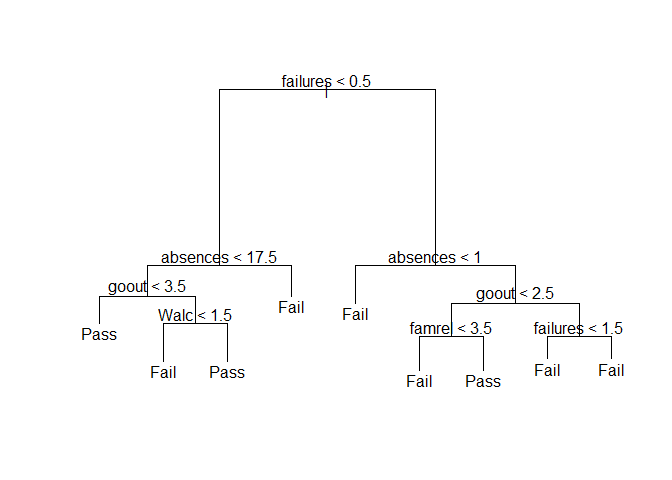
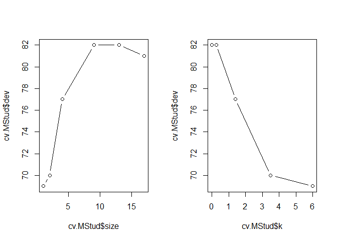
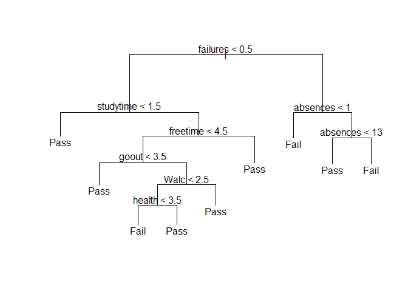
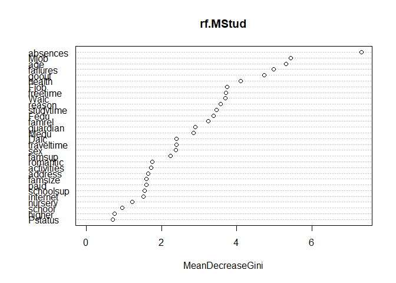

06 - Chapter Six - Decision Tree
================
Nima Niarad
7/24/2021

<style> body {text-align: justify} </style>

<!-- Justify text. -->

### **Decision Tree**

**Introduction**

Applying Decision Tree, and three other methods to improve it; Bagging,
Boosting and Random Forest. At the end, comparing the results and
explaining them in much more details.

**Loading library and data…**

``` r
library(tree)
MStud=read.table("C:/Nima/Data/student-mat.csv",sep=";",header=TRUE)
attach(MStud)
VG3= ifelse(G3>=10 ,"Pass","Fail")
MStud = data.frame(MStud , VG3)
MStud$VG3=as.factor(MStud$VG3)
```

**Fitting the Tree**

``` r
tree.MStud = tree(VG3 ~.-G2-G1-G3, data = MStud)
summary(tree.MStud)
```

    ## 
    ## Classification tree:
    ## tree(formula = VG3 ~ . - G2 - G1 - G3, data = MStud)
    ## Variables actually used in tree construction:
    ## [1] "failures" "absences" "goout"    "Walc"     "famrel"  
    ## Number of terminal nodes:  9 
    ## Residual mean deviance:  1.062 = 409.8 / 386 
    ## Misclassification error rate: 0.2405 = 95 / 395

``` r
plot(tree.MStud)
text(tree.MStud)
```

<!-- -->

**Evaluation: Confusion Matrix**

The important part is about the test error rate. I will get the rate and
try to select the best number of tree nods in terms of the lowest error
rate.

``` r
set.seed (2)
train = sample(1:nrow(MStud), nrow(MStud)/2)
MStud.test = MStud[-train, ]
VG3.test =VG3[- train ]

tree.MStud =tree(VG3 ~.-G2-G1-G3 , MStud , subset =train )
tree.pred = predict(tree.MStud , MStud.test ,type ="class")
table(tree.pred ,VG3.test)
```

    ##          VG3.test
    ## tree.pred Fail Pass
    ##      Fail   21   19
    ##      Pass   43  115

``` r
print("Test Error Rate"); print((43+19)/(21+19+4+115))
```

    ## [1] "Test Error Rate"

    ## [1] 0.3899371

This approach leads to correct predictions for around %62 in the test
data set.

**Apply CV (Cross Validation Method) to select Best Tree Size**

``` r
set.seed(2)
cv.MStud =cv.tree(tree.MStud ,FUN = prune.misclass )
names(cv.MStud)
```

    ## [1] "size"   "dev"    "k"      "method"

``` r
cv.MStud
```

    ## $size
    ## [1] 17 13  9  4  2  1
    ## 
    ## $dev
    ## [1] 81 82 82 77 70 69
    ## 
    ## $k
    ## [1] -Inf 0.00 0.25 1.40 3.50 6.00
    ## 
    ## $method
    ## [1] "misclass"
    ## 
    ## attr(,"class")
    ## [1] "prune"         "tree.sequence"

-   dev corresponds to the cross-validation error rate.

``` r
par(mfrow = c(1 ,2))
plot(cv.MStud$size ,cv.MStud$dev , type ="b")
plot(cv.MStud$k ,cv.MStud$dev , type ="b")
```

<!-- -->

The best one is including 2 nods! But it cannot be helpful. 5 and 6 has
the same error rate, and I go for 6 to have more variables in the model.

-   Applying the prune.misclass() function in order to prune the tree to
    obtain the 6-node tree:

``` r
prune.MStud = prune.misclass(tree.MStud , best =6)
plot( prune.MStud )
text( prune.MStud , pretty =0)
```

<!-- -->

``` r
tree.pred = predict(prune.MStud , MStud.test , type ="class")
table(tree.pred ,VG3.test)
```

    ##          VG3.test
    ## tree.pred Fail Pass
    ##      Fail   20   12
    ##      Pass   44  122

``` r
print("Test Error Rate"); print((44+12)/(20+12+44+122))
```

    ## [1] "Test Error Rate"

    ## [1] 0.2828283

This is the best test error rate I have got so far. Now %72 of the test
observations are correctly classified. The classification accuracy is
also improved.

I also repeat the process for G1 and G2, but before performing that, it
is better to apply Random Forest, Boosting, and begging approaches to
see if I can get a better result than above (DT).

What I do is improving the DT using bagging, random forests, and
boosting methods.

### **Bagging**

Using the randomForest package considering all predictors.

``` r
library(randomForest)
```

    ## randomForest 4.6-14

    ## Type rfNews() to see new features/changes/bug fixes.

``` r
set.seed(2)
bag.MStud = randomForest(VG3 ~.-G1-G2-G3, data = MStud, subset = train, mtry=34, important=T)
```

    ## Warning in randomForest.default(m, y, ...): invalid mtry: reset to within valid
    ## range

``` r
bag.MStud
```

    ## 
    ## Call:
    ##  randomForest(formula = VG3 ~ . - G1 - G2 - G3, data = MStud,      mtry = 34, important = T, subset = train) 
    ##                Type of random forest: classification
    ##                      Number of trees: 500
    ## No. of variables tried at each split: 30
    ## 
    ##         OOB estimate of  error rate: 36.04%
    ## Confusion matrix:
    ##      Fail Pass class.error
    ## Fail   18   48   0.7272727
    ## Pass   23  108   0.1755725

``` r
yhat.bag = predict(bag.MStud , MStud.test , type ="class")
table(yhat.bag ,VG3.test)
```

    ##         VG3.test
    ## yhat.bag Fail Pass
    ##     Fail   28   23
    ##     Pass   36  111

``` r
print("Test Error Rate"); print((36+23)/(28+23+36+111))
```

    ## [1] "Test Error Rate"

    ## [1] 0.2979798

There is a %29 misclassification.

### **Random Forest**

``` r
library(randomForest)
set.seed(2)
rf.MStud = randomForest(VG3 ~.-G1-G2-G3, data = MStud, subset = train, important=T)

#mtry: The default number is sqrt(p) for classification; 

yhat.bag = predict(rf.MStud , MStud.test , type ="class")
table(yhat.bag ,VG3.test)
```

    ##         VG3.test
    ## yhat.bag Fail Pass
    ##     Fail   15   16
    ##     Pass   49  118

``` r
print("Test Error Rate"); print((49+16)/(15+16+49+118))
```

    ## [1] "Test Error Rate"

    ## [1] 0.3282828

``` r
## variable importance
importance(rf.MStud)
```

    ##            MeanDecreaseGini
    ## school            0.9479854
    ## sex               2.3768417
    ## age               5.3168092
    ## address           1.6395334
    ## famsize           1.5997474
    ## Pstatus           0.6978252
    ## Medu              2.8454967
    ## Fedu              3.3864249
    ## Mjob              5.4417257
    ## Fjob              3.7444912
    ## reason            3.5773919
    ## guardian          2.8950955
    ## traveltime        2.3896172
    ## studytime         3.4624306
    ## failures          4.9912661
    ## schoolsup         1.5539565
    ## famsup            2.2420401
    ## paid              1.5950858
    ## activities        1.7194014
    ## nursery           1.2105502
    ## higher            0.7442288
    ## internet          1.5226541
    ## romantic          1.7458056
    ## famrel            3.2405145
    ## freetime          3.7180849
    ## goout             4.7316381
    ## Dalc              2.3990795
    ## Walc              3.6928935
    ## health            4.1124148
    ## absences          7.3157020

``` r
varImpPlot(rf.MStud)
```

<!-- -->

Here, I have applied all 30 variables (except G1 and G2) to figure out
the important ones for the model. Random Forest suggests that I should
consider “failures”, “absences”, “goout”, “freetime”, “Mjob”, “age”, and
“Health” as the top priority predictors.
